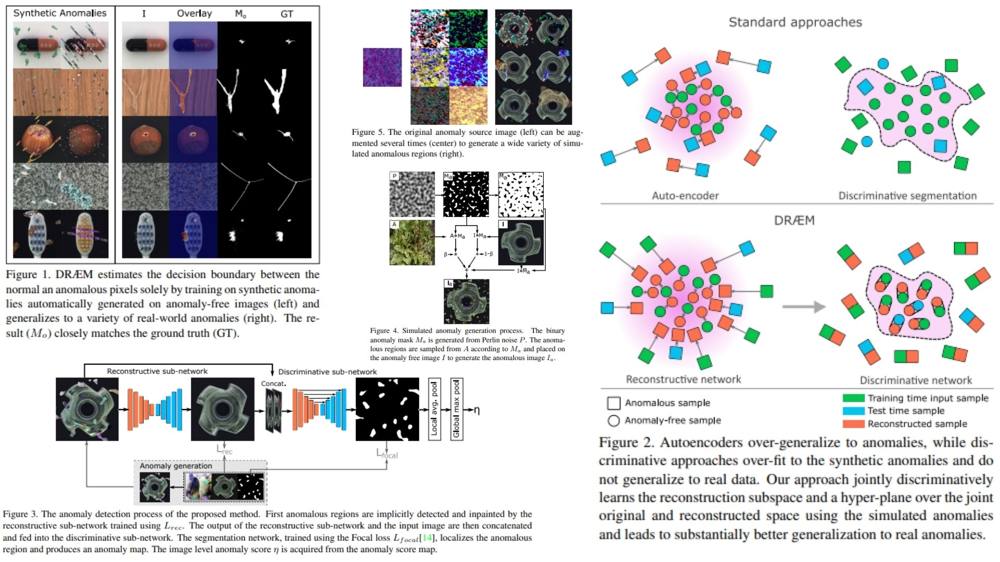

# 😴 DRAEM-Replication — Discriminatively Trained Reconstruction Embedding

This repository provides a **faithful Python replication** of the **DRÆM framework** for surface anomaly detection.  
The goal is to **reproduce the pipeline from the paper** without performing full training or testing.

Highlights:

* Discriminative **reconstruction-based anomaly embedding** 🌀  
* Joint **reconstructive & discriminative networks** 🖥️  
* Pixel-level anomaly maps $$M_o$$ and image-level scores $$\eta$$ 📊
  
Paper reference: *[DRÆM: Discriminatively Trained Reconstruction Embedding for Surface Anomaly Detection](https://arxiv.org/abs/2108.07610)*  

---

## Overview 🎨



> The pipeline learns a **joint representation** between an input image and its reconstructed version.  
> Anomalies are localized by detecting deviations in the reconstruction, without requiring real anomalous samples.

Key points:

* **Reconstructive sub-network**: maps $$I_a \rightarrow I_r$$, restoring anomaly-free content  
* **Discriminative sub-network**: concatenates $$[I_a, I_r]$$ and outputs pixel-level map $$M_o$$  
* **Simulated anomalies**: generated via Perlin noise & random textures  
* **Image-level score** $$\eta$$: computed from $$M_o$$ using local + global pooling  

---

## Core Math 📐

Reconstruction loss:

$$
\mathcal{L}_\text{rec}(I, I_r) = \lambda L_\text{SSIM}(I, I_r) + \|I - I_r\|_2^2
$$

Segmentation (discriminative) loss using Focal Loss:

$$
\mathcal{L}_\text{seg}(M_a, M_o) = - \alpha (1-M_o)^\gamma \log(M_o) \cdot M_a - (1-\alpha) M_o^\gamma \log(1-M_o) \cdot (1-M_a)
$$

Total training objective:

$$
\mathcal{L}(I, I_r, M_a, M_o) = \mathcal{L}_\text{rec}(I, I_r) + \mathcal{L}_\text{seg}(M_a, M_o)
$$

Image-level score from pixel map:

$$
M_o^\text{local} = \text{LP}(M_o)
$$

$$
\eta_\text{max} = \max\big(M_o^\text{local}\big)
$$


---

## Why DRÆM Matters 🌿

* Learns **pixel-level anomaly maps** without real anomalous images 🧩  
* Jointly optimizes reconstruction and discriminative embedding for better localization 🖼️🌀  
* Generates **simulated anomalies** to tighten the decision boundary  
* Modular design: extendable to other backbones or embeddings 🔧  

---

## Repository Structure 🏗️

```bash
DRAEM-Replication/
├── src/
│   ├── data/
│   │   ├── anomaly_generator.py     # simulated anomalies: Ia, Ma
│   │   └── augmentations.py         # random augmentations for textures
│   │
│   ├── layers/
│   │   ├── reconstructive_net.py    # Ia → Ir
│   │   ├── discriminative_net.py    # [Ia, Ir] → Mo
│   │   └── unet_blocks.py           # U-Net building blocks
│   │
│   ├── modules/
│   │   ├── loss.py                   # Lrec + Lseg (optional, theoretical)
│   │   ├── ssim.py                   # SSIM computation (optional)
│   │   └── anomaly_map.py            # Mo → η
│   │
│   ├── model/
│   │   └── draem.py                  # full pipeline forward: Ia → Ir → Mo → η
│   │
│   └── config.py                     # Hyperparameters: λ, γ, α, beta range
│
├── images/
│   └── figmix.jpg                     # pipeline overview from paper
│
├── requirements.txt
└── README.md

```

---

## 🔗 Feedback

For questions or feedback, contact:  
[barkin.adiguzel@gmail.com](mailto:barkin.adiguzel@gmail.com)
